# ZFX 支付中心系统 - 业务流程图文档

## 1. 支付业务流程

### 1.1 支付订单创建流程

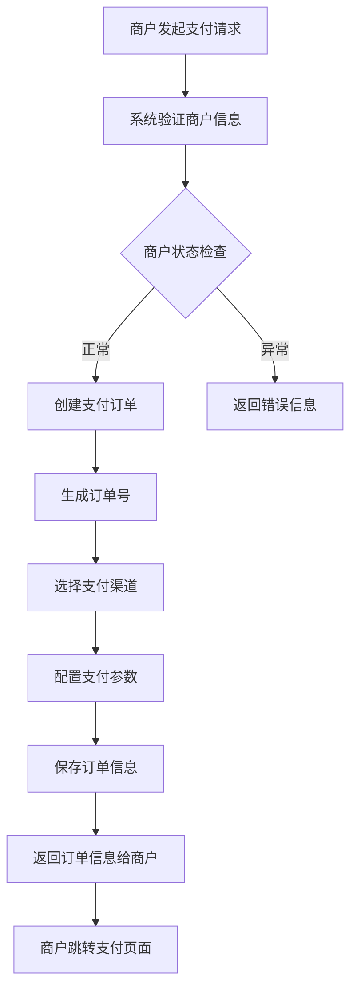

### 1.2 支付处理流程

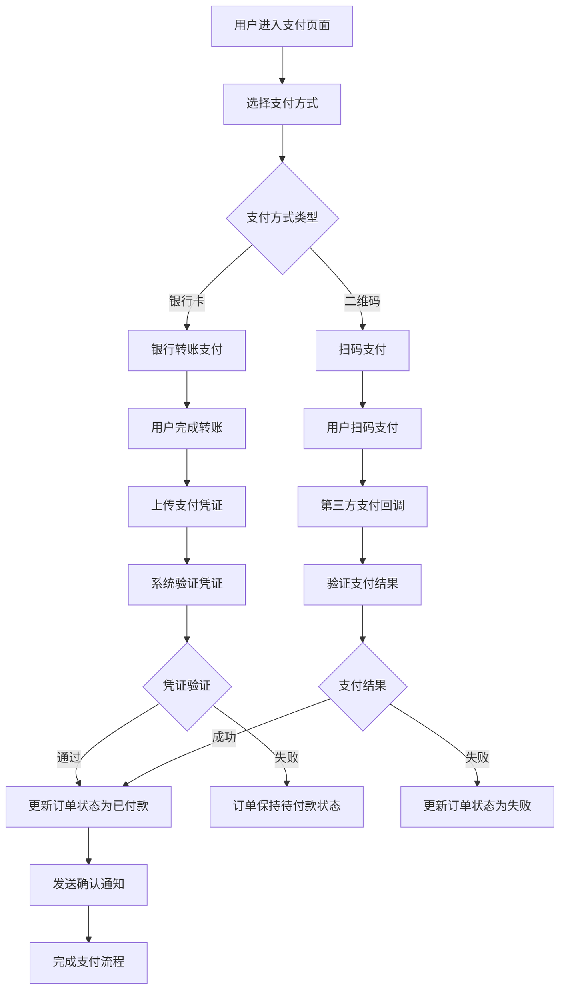

### 1.3 订单确认流程

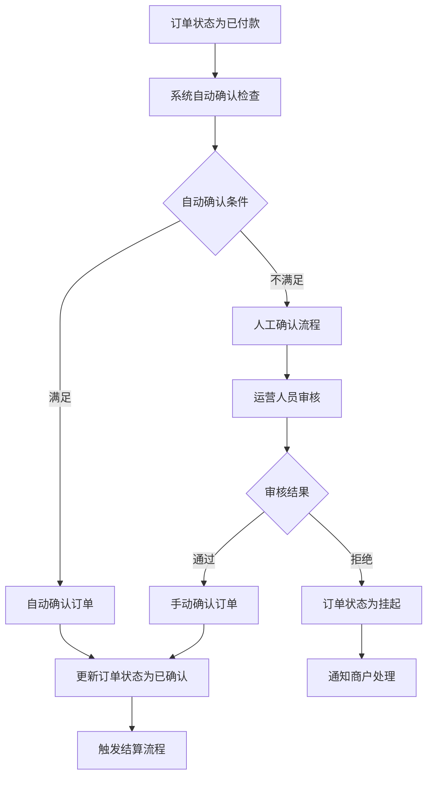

## 2. 结算业务流程

### 2.1 结算单生成流程

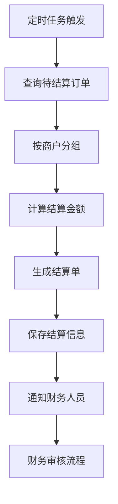

### 2.2 结算审核流程

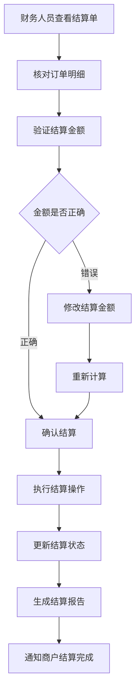

### 2.3 结算处理流程

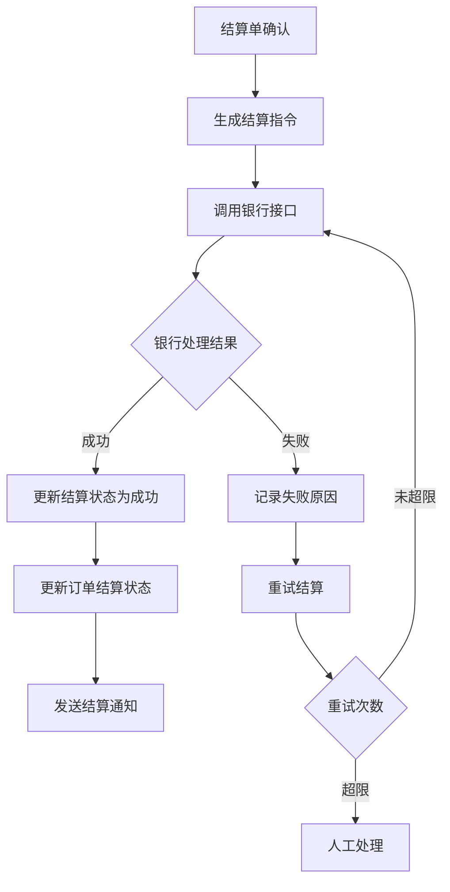

## 3. 商户管理流程

### 3.1 商户注册流程

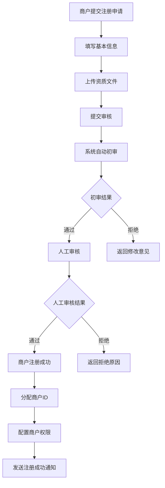

### 3.2 商户卡片管理流程

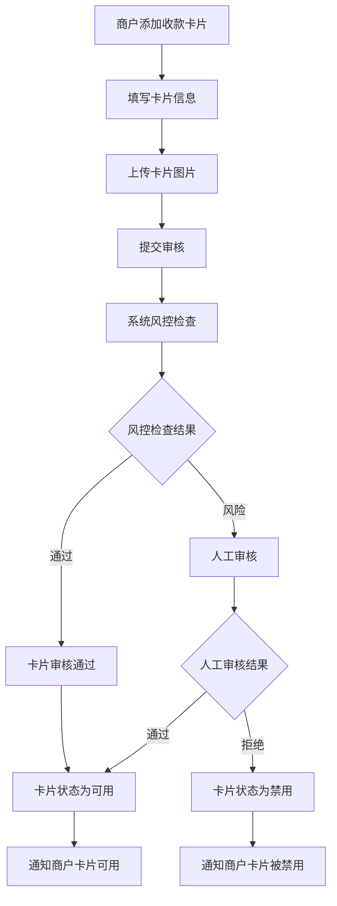

## 4. 风控管理流程

### 4.1 订单风控检查流程

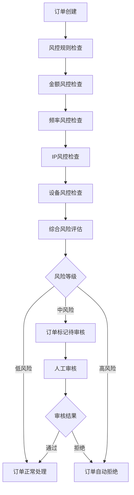

### 4.2 风控规则配置流程

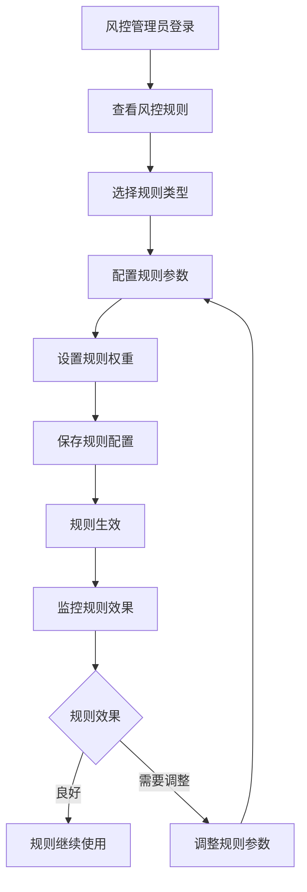

## 5. 系统管理流程

### 5.1 用户权限管理流程

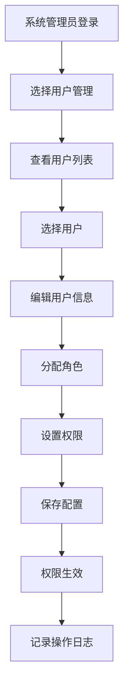

### 5.2 系统配置管理流程

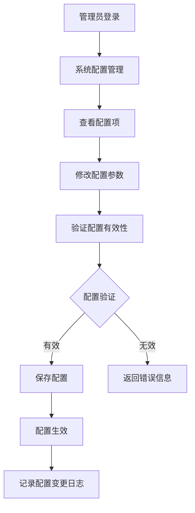

## 6. 数据同步流程

### 6.1 第三方数据同步流程

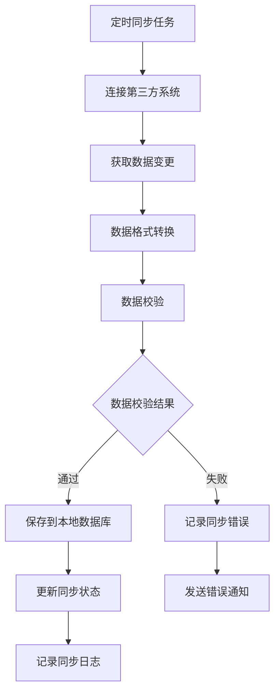

## 7. 异常处理流程

### 7.1 系统异常处理流程

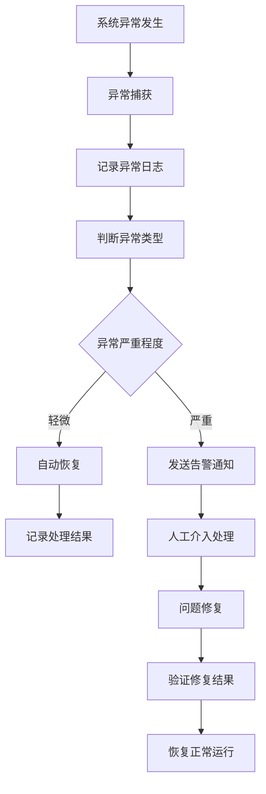

### 7.2 业务异常处理流程

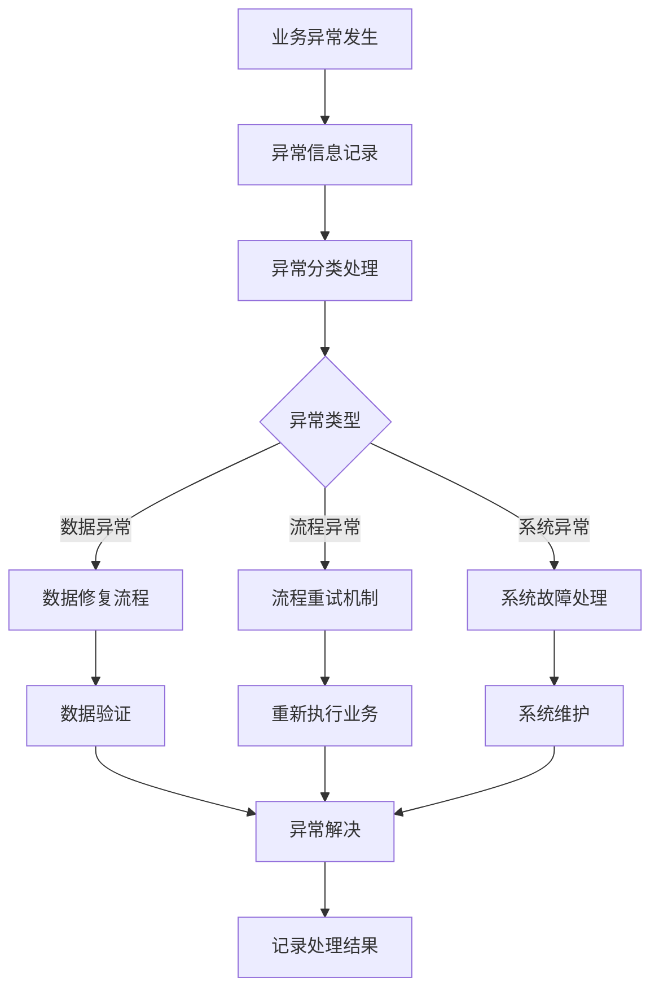

## 8. 监控告警流程

### 8.1 系统监控流程

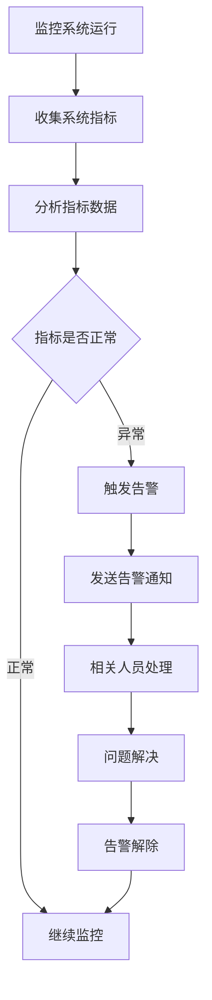

### 8.2 业务监控流程

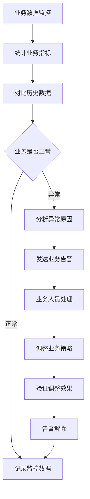

---

**文档版本**: v1.0  
**创建日期**: 2024-09-29  
**更新日期**: 2024-09-29  
**创建人**: AI Assistant  
**审核人**: 待定
